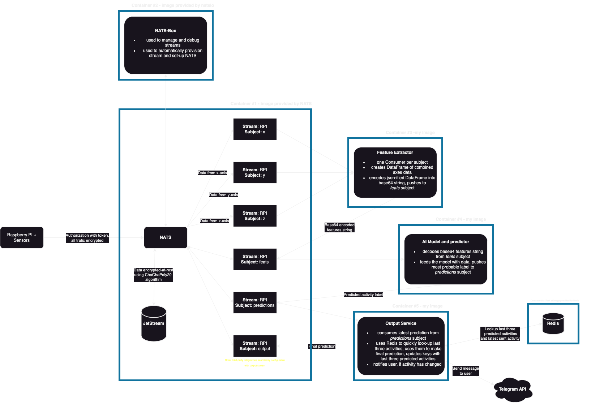

# Raspberry Pi HAR app
## Architecture



### Components
Because of ease of use and scalability, as well as potential for future HA mechanisms (e.g. deploying the application on Kubernetes) I have decided to use microservices architecture. Application consists of four main components:

1. Raspberry Pi equipped with **LSM6DS3TR-C + LIS3MDL 9DOF IMU** and pre-installed data gathering script.
2. **NATS** server with **JetStream** persistance layer acts as a message broker, enabling communication between each of the microservices.
3. **FeatureExtracor** container consumes data from NATS streams and computes signals' characteristic features.
4. **ML Model and prediction** container consumes data from `feats` stream and turns it into highly-accurate human activity prediciton.

### Raspberry Pi + Sensors
Script located in the `rpi-site` directory gathers data from accelerometer and transforms it into format suitable for our model (data should be expressed as a fraction of Earth's gravitational acceleration).

Raspberry Pi starts gathering the data, transforms it and sends it to a subject corresponding to each axis.

### NATS
From NATS website:

```txt
NATS is a connective technology built for the ever increasingly hyper-connected world. 
It is a single technology that enables applications to securely communicate across any combination of cloud vendors, on-premise, edge, web and mobile, and devices. 
NATS consists of a family of open source products that are tightly integrated but can be deployed easily and independently. 
NATS is being used globally by thousands of companies, spanning use-cases including microservices, edge computing, mobile, IoT and can be used to augment or replace traditional messaging.

The NATS Server acts as a central nervous system for building distributed applications. 
Official clients are available in Go, Rust, JavaScript (Node and Web), TypeScript (Deno), Python, Java, C#, C, Ruby, Elixir and a CLI in addition to 30+ community-contributed clients. 
Real time data streaming, highly resilient data storage and flexible data retrieval are supported through JetStream, the next generation streaming platform built into the NATS server.
```

In my case, NATS acts as a message broker connecting Raspberry Pi and each of the microservices. Data from Raspberry Pi is stored in three subjects: `x`, `y` and `z` each corresponding data gathered from each axis. Features extracted from signals are stored in `feats` subject and final activity predicitons for each window - in `predictions`.

Using subjects as queues ensures that all the data will be consumed by FeatureExtractor and fed the ML model.

### FeatureExtractor
To feed our ML model, it has to be fed to extract characteristic features from the gathered data. 

FeatureExtractor consumes signals from each axis, computes the features and sends pandas DataFrame in form of base64-encoded json to `feats` subject. Container containing ML model will consume the last feature message and reconstruct the DataFrame.

### ML Model and prediction
After consumption of the feature message, the message will be used to reconstruct DataFrame containing features. My ML model will be fed with this data and will output predicted activity. Then, this data will be send to `predicitons` subject.

Storing predicted data in NATS subject makes it easy to further use predicted activity for e.g. web applications or sending user notifications.

## Deployment
### Raspberry Pi
Start with the following steps:

- Make sure to use `Raspberry Pi OS Lite (32-bit) Release: 2023-05-03`,
- Equip your RPi *LSM6DS3TR-C + LIS3MDL 9DOF IMU sensor*,
- Enable *I2C* interface on your RPi. Example tutorial can be found here: [link](https://www.raspberrypi-spy.co.uk/2014/11/enabling-the-i2c-interface-on-the-raspberry-pi/),
- Be sure to install all updates using `apt`,
- Set your Git credentials on RPi.


If you have successfully completed prerequisites, you may run the following commands:

```bash
# clone the repo 
git clone https://github.com/Michal148/project-HAR.git

# change branch to RPI-dev
git checkout RPI-dev

# change to correct directory 
cd rpi/rpi-site

# be sure to store NATS token and address into environmental variables
export NATS_ADDRESS=address_here
export NATS_TOKEN=token_here

# install dependencies
pip install -r requirements.txt

# run the script in the background, log all to RPI-data.log file
nohup python3 PubDataNATS.py > RPI-data.log 2>&1 &
```

### Containers - local environment
For rapid testing of new container images, you may want to deploy the container infrastructure. Here are prerequisites:

1. Be sure to have all TLS certs and keys in folders of each container:

|Folder|Required files|
|---|---|
|`feature-extractor`|**container1-cert.pem**, **container1-key.pem**, **CA.pem**|
|`ML-model`|**container2-cert.pem**, **container2-key.pem**, **CA.pem**|
|`nats-config`|**container3-cert.pem**, **container3-key.pem**, **CA.pem**, **auth.conf**|
|`output-service`|**container5-cert.pem**, **container5-key.pem**, **CA.pem**|
|`redis-config`|**redis-cert.pem**, **redis-key.pem**, **CA.pem**, **redis.conf**|
|`rpi-site`|**container4-cert.pem**, **container4-key.pem**, **CA.pem**|

2. At the root folder of the repository create `.env` file containing the following variables:

- `NATS_TOKEN`=**your token here**
- `NATS_ADDRESS`=nats
- `JS_KEY`=**JetStream encryption key**
- `REDIS_PASSWORD`=**your Redis password here**
- `REDIS_ADDRESS`=redis
- `TELEGRAM_KEY`=**Telegram API key here**
- `TELEGRAM_CHAT`=**Telegram chat ID here**

After prerequisites are fullfilled, you may run:

```bash
docker compose -f compose.local.yaml up
```

Then, exec into `nats-box` container and run: 

```bash
nats context save local --server nats://$NATS_TOKEN@nats:4222 --description 'docker' --select --tlscert="/root/container3-cert.pem" --tlskey="/root/container3-key.pem" --tlsca="/root/CA.pem" && nats stream add --config="/root/rpi-stream.json"
```

Now, you may start gathering data on your from Raspberry Pi 😊. 

### Containers - Azure
For full production deployment, you may want to deploy the application on Azure. Here are prerequisites:

1. Be sure to have all TLS certs and keys in folders of each container:

|Folder|Required files|
|---|---|
|`feature-extractor`|**container1-cert.pem**, **container1-key.pem**, **CA.pem**|
|`ML-model`|**container2-cert.pem**, **container2-key.pem**, **CA.pem**|
|`nats-config`|**container3-cert.pem**, **container3-key.pem**, **CA.pem**, **auth.conf**|
|`output-service`|**container5-cert.pem**, **container5-key.pem**, **CA.pem**|
|`redis-config`|**redis-cert.pem**, **redis-key.pem**, **CA.pem**, **redis.conf**|
|`rpi-site`|**container4-cert.pem**, **container4-key.pem**, **CA.pem**|

2. At the root folder of the repository create `.env` file containing the following variables:

- `NATS_TOKEN`=**your token here**
- `NATS_ADDRESS`=nats
- `SHARE_NAME`=**file share name**
- `SA_NAME`=**storage account name here**
- `JS_KEY`=**JetStream encryption key**
- `REDIS_PASSWORD`=**your Redis password here**
- `REDIS_ADDRESS`=redis
- `TELEGRAM_KEY`=**Telegram API key here**
- `TELEGRAM_CHAT`=**Telegram chat ID here**
- `AZURE_CONTEXT`=**docker context used for Azure**

Then, you may run the following command to provision the whole infrastructure:

```bash
# change permission for script
chmod +x ./infra/createInfraAndDeploy.sh

# run the provisioning script (this may take a while)
./infra/createInfraAndDeploy.sh
```
`createInfraAndDeploy.sh`:

1. Switches Docker context to the one used for Azure deployment and logs out the user to avoid deployment conflicts.
2. Creates Resource group "RPI-Cloud".
3. Creates Storage Account called $SA_NAME.
4. Creates File Share called $SHARE_NAME.
5. Uploads all config files as well as certs to $SHARE_NAME.
6. Runs `docker compose up` to deploy the infra.

The IP address needed to connect to NATS can be found in section *Properties* in deployed Azure Conatiner Instances NavBar.

# TODO
- [ ] Upload mechanical models and blueprints.
- [ ] Update the docs for engineering thesis layout - both READMEs and in code.
- [x] Fix wiring in RPI.
- [x] Test Telegram messaging service.
- [x] Integrate output-service with Telegram.
- [x] Create new ml_predictor image with the latest model.
- [x] Add service to compare and average four previous predicted labels.
- [x] Fix fetaure-extractor Pandas bug.
- [x] Upload Redis, label comparator image to DockerHub.
- [x] Fix label comparator.
- [x] Delete automatic tag detection in Compose.
- [x] Change Docker Compose file to provison all new containers.
- [x] Write script to connect to Redis and perform label comparison.
- [x] Add database for storing previous predictions labels.
- [x] Fix crashing nats-box container.
- [x] Create an internet gateway for ACI environment.
- [x] Add TLS.
- [x] Add encryption-at-rest to JetStream.
- [x] Determine correct retention parameters for stream.
- [x] Create scripts to automatically provision infrastructure.
- [x] Enable containers to still work after some time of inactivity.
- [x] Set up ML model and predictions container.
- [x] Check if sampling in data gathering is correct.
- [x] Create Docker Compose file to manage the container infra.
- [x] Set up correct NATS .conf files with balanced subject parameters.